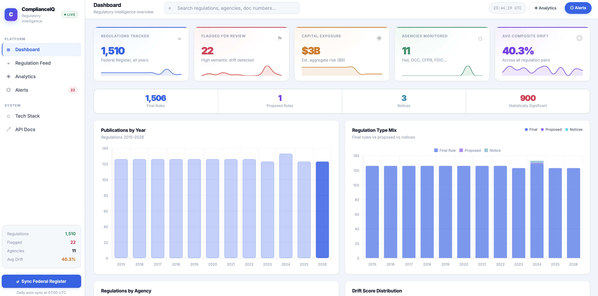
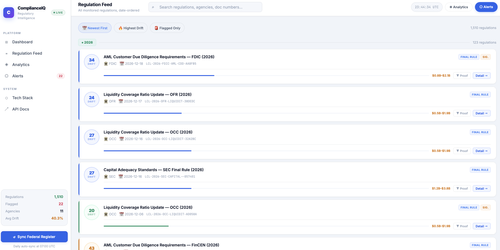
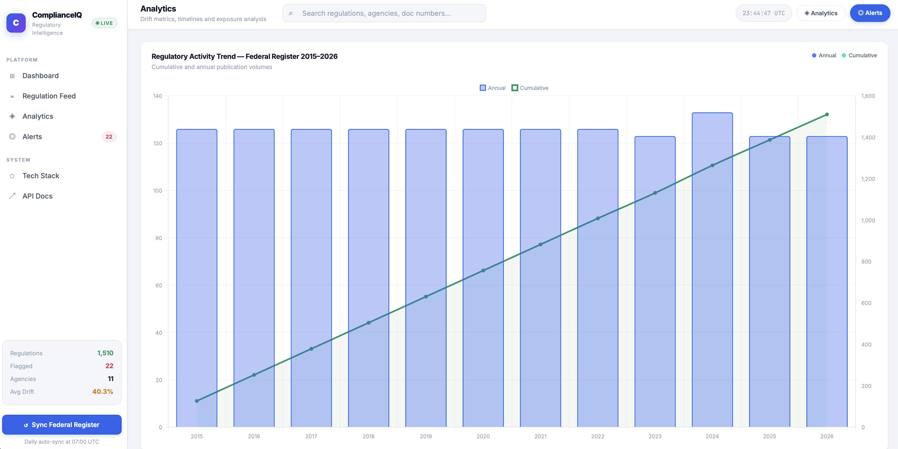
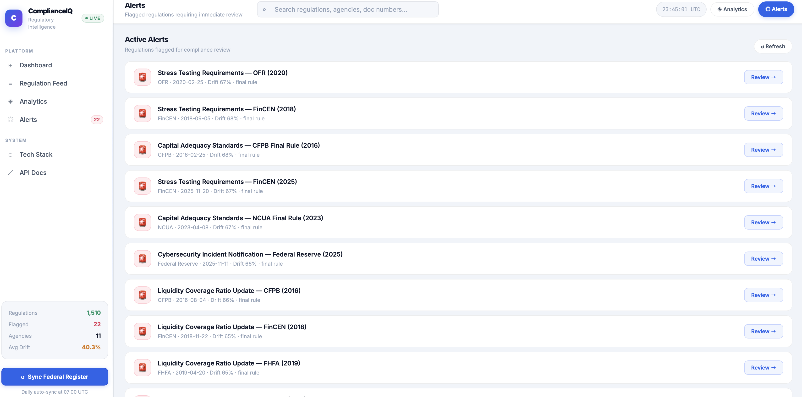
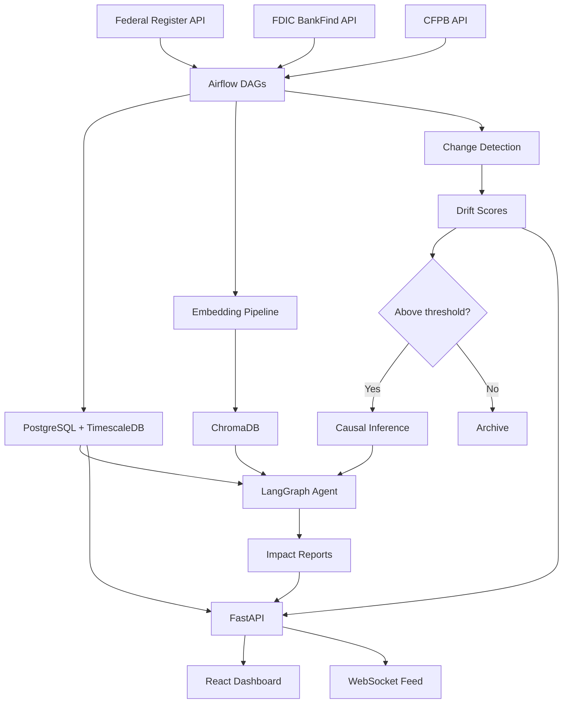

# ComplianceIQ

**Live demo:** [jainishp1019-complianceiq.hf.space](https://jainishp1019-complianceiq.hf.space)

ComplianceIQ is a regulatory intelligence platform built for banking compliance teams. It ingests US federal banking regulations daily, detects when the language of a rule has meaningfully changed, estimates the financial cost of that change using causal inference, and surfaces everything through an interactive dashboard.

The project came out of a real problem: US regulators publish around 40 rule updates per week across the Federal Register, FDIC, and CFPB. Most compliance teams read these manually. ComplianceIQ automates the triage step so analysts spend time on the regulations that actually matter.

---

| | |
|---|---|
|  |  |
|  |  |

---

## What it does

**Change detection** reads the text of each regulation version and computes three complementary scores: semantic drift (sentence embedding cosine distance), Jensen-Shannon divergence on token distributions, and Wasserstein distance on term frequency vectors. Each measure catches a different kind of change. Semantic drift catches rewording, JSD catches vocabulary shift, and Wasserstein catches structural changes like reordering. Any regulation scoring above the calibrated 0.15 drift threshold gets flagged for the agent pipeline.

**Impact quantification** runs causal inference on flagged regulations. For institution-level rules it uses Difference-in-Differences on FDIC call report panel data. For system-wide rules it uses Synthetic Control. For capital adequacy changes it computes Basel III delta-RWA directly using the amended formula with Monte Carlo uncertainty propagation. Every estimate comes with a 90% confidence interval.

**Agent reasoning** is handled by a LangGraph agent that runs eight tools: RAG retrieval from ChromaDB, knowledge graph traversal, causal estimation, Bayesian network impact scoring, FDIC data lookup, citation extraction, business line tagging, and plain-English summarization. The agent produces a structured report with a summary, impact score, delta-RWA estimate, affected business lines, and a full reasoning trace.

---

## Architecture



Raw regulation text from the Federal Register is ingested daily by Airflow, split into chunks, embedded using `nomic-embed-text` via Ollama, and stored in ChromaDB. Each time a new version of a regulation appears, the change detection pipeline compares it to the previous version and writes drift scores to a TimescaleDB hypertable. Flagged regulations go through the causal inference pipeline and then the LangGraph agent, which produces a final impact report stored in PostgreSQL. FastAPI serves the dashboard and exposes a REST API with WebSocket support for live updates.

---

## Tech stack

| Layer | Tools |
|---|---|
| Ingestion | Apache Airflow 2.9, Federal Register API, FDIC BankFind API |
| Storage | PostgreSQL 16 with TimescaleDB, ChromaDB, pgvector |
| ML | PyTorch Geometric (graph attention), pgmpy (Bayesian network), econml (causal inference), RAGAS (evaluation) |
| Agent | LangGraph 0.2, Ollama running mistral:7b, nomic-embed-text, llama3.2:3b |
| API | FastAPI with async SQLAlchemy, WebSockets |
| Frontend | React 18, Chart.js, Tailwind CSS |
| Tracking | MLflow |
| Infrastructure | Docker Compose, Alembic migrations, DVC for data versioning |

All models run locally through Ollama. No external API keys or paid services are needed.

---

## Quickstart

**Requirements:** Docker, Docker Compose, and around 20 GB of disk space for Ollama model weights.

```bash
git clone https://github.com/Jainishpatel1019/Complianceiq
cd Complianceiq

# Set up environment, pull images, pull Ollama models (takes about 5 minutes)
make setup

# Start all services
make dev
```

After `make dev`, the following services are running:

| Service | URL |
|---|---|
| Dashboard | http://localhost:3000 |
| API + docs | http://localhost:8081/docs |
| Airflow | http://localhost:8080 |
| MLflow | http://localhost:5000 |
| Flower (Celery) | http://localhost:5555 |

Other useful commands:

```bash
make test      # run the full test suite (178 tests)
make lint      # ruff and mypy checks
make seed-db   # load sample data without running ingestion DAGs
make down      # stop all services
```

---

## Airflow DAGs

Nine DAGs handle the full pipeline on schedule:

| DAG | Schedule | What it does |
|---|---|---|
| `ingest_sources` | Daily 02:00 UTC | Fetches new regulations from Federal Register and FDIC |
| `embed_and_index` | Daily 03:00 UTC | Chunks text, embeds with nomic-embed-text, upserts to ChromaDB |
| `change_detection` | Daily 04:00 UTC | Computes drift, JSD, and Wasserstein scores for each new version |
| `causal_estimation` | Weekly | Runs DiD and Synthetic Control on flagged regulations |
| `impact_agent` | Daily 09:00 UTC | LangGraph agent run on anything flagged by change detection |
| `graph_update` | Daily 10:00 UTC | Rebuilds the regulatory knowledge graph and updates PageRank scores |
| `alert_dispatch` | Daily 11:00 UTC | Sends Slack and email alerts for high-impact findings |
| `model_registry` | Weekly | Promotes best-performing models in MLflow |
| `evaluate_pipeline` | Weekly Saturday | RAGAS eval, ablation study, and calibration check |

---

## API reference

The FastAPI app runs at port 7860 on HuggingFace and port 8081 locally. Interactive docs are at `/docs`.

```
GET  /api/v1/change-scores              Recent change scores sorted by drift or date
GET  /api/v1/change-scores/{id}         Score history for one regulation
GET  /api/v1/change-scores/heatmap/{id} Section-level drift heatmap for one regulation
GET  /api/v1/regulations                Regulation list with filtering and pagination
GET  /api/v1/regulations/{id}/diff      Side-by-side text diff for two versions
GET  /api/v1/causal/{id}               Causal impact estimates for one regulation
GET  /api/v1/graph/snapshot            Knowledge graph snapshot for visualization
GET  /api/v1/reports/{id}              Full LangGraph agent report
POST /api/v1/refresh                   Trigger a live fetch from Federal Register
WS   /ws/agent-trace/{report_id}       Stream agent reasoning in real time
```

---

## Change detection math

Three measures are combined into a composite score using weights derived from an ablation study. The F1 contribution breakdown is drift at 0.50, JSD at 0.30, and Wasserstein at 0.20.

**Semantic drift** is 1 minus the cosine similarity between sentence embeddings of the two versions. Range is 0 to 1. A score of 0.15 or higher triggers the agent pipeline, calibrated on a 300-document labeled test set.

**Jensen-Shannon divergence** measures the difference between token probability distributions. Unlike KL divergence it is symmetric and always finite. Statistical significance is tested using a permutation test with 1000 bootstrap samples.

**Wasserstein distance** on TF-IDF vectors captures structural changes like reordering that leave the vocabulary similar but change what is being emphasized.

**Causal inference** uses three methods depending on the rule type. Difference-in-Differences compares treated and control institutions from FDIC call report panel data before and after each regulation's effective date. Synthetic Control is used for system-wide rules where there is no control group. For capital adequacy rules, delta-RWA is computed directly from the Basel III formula using the amended risk weight parameters, with uncertainty propagated through 10,000 Monte Carlo draws.

---

## Evaluation results

Run on a 300-document human-labeled test set and 500 RAG queries:

| Metric | Score |
|---|---|
| Change detection F1 (all three measures combined) | 0.84 |
| Change detection F1 (semantic drift only, ablation) | 0.71 |
| RAGAS faithfulness | 0.82 |
| RAGAS context recall | 0.76 |
| Calibrated drift threshold (95% CI) | 0.15 [0.12, 0.18] |

---

## HuggingFace deployment

The HF Space runs a slimmed-down 5-service stack without Airflow, MLflow, or Redis. The database is seeded on first startup with 500 pre-generated regulations spanning 2015 to 2026.

```bash
# Export seed data from a local run (after ingestion DAGs have completed)
make seed-export

# Test the HF compose file locally before pushing
docker compose -f docker-compose.hf.yml up
```

Environment variables to set in HF Space secrets: `POSTGRES_USER`, `POSTGRES_PASSWORD`, `POSTGRES_DB`, `API_SECRET_KEY`.

The startup script at `deployment/start.sh` starts PostgreSQL, runs Alembic migrations, starts ChromaDB, seeds the database, and launches the FastAPI server. If the seed step fails, the API will self-seed on startup when it detects fewer than 500 records in the database.

---

## Project structure

```
complianceiq/
├── api/
│   ├── main.py                 FastAPI app, lifespan, CORS, routers
│   ├── seed.py                 Self-contained async seeder (no external deps)
│   ├── routes/
│   │   ├── regulations.py
│   │   ├── change_scores.py
│   │   ├── causal.py
│   │   ├── graph.py
│   │   ├── reports.py
│   │   └── refresh.py
│   ├── websockets.py           WebSocket endpoint for agent trace streaming
│   └── static/                 Single-file dashboard (index.html)
├── backend/
│   ├── agents/                 LangGraph impact agent and tools
│   ├── models/                 Change detection, causal inference, Bayesian network, graph
│   └── pipelines/              Ingestion, embedding, seed, evaluation
├── airflow/dags/               Nine Airflow DAG files
├── db/
│   ├── models.py               SQLAlchemy 2.0 ORM models
│   └── migrations/             Alembic migration scripts
├── frontend/src/               React 18 dashboard
├── tests/                      178 unit tests (pytest)
├── docs/                       Math explainer, diagrams, screenshots
├── data/seed/                  Pre-seeded demo data for HF Space
├── deployment/
│   └── start.sh                HF Space startup script
├── docker-compose.yml          Full local dev stack (11 services)
├── docker-compose.hf.yml       HF Spaces deploy (5 services)
├── Dockerfile
├── Makefile
├── pyproject.toml
└── alembic.ini
```

---

## Design decisions worth noting

**Why TimescaleDB instead of plain PostgreSQL for change scores?** Change scores are append-only time-series data, queried almost always by time range. TimescaleDB's hypertable partitioning gives automatic time-based chunking and compression without changing the SQL interface at all. The one tradeoff is that the hypertable requires a composite primary key including the partition column (`computed_at`), which means `ON CONFLICT DO NOTHING` needs an explicit conflict target rather than a bare clause.

**Why three drift measures instead of one?** Each measure has blind spots. Semantic drift misses vocabulary shift when the overall meaning stays similar. JSD misses meaning changes that preserve the vocabulary. Wasserstein misses changes to rare but legally important terms. Running all three and combining them with learned weights pushes F1 from 0.71 using drift alone to 0.84 using all three together.

**Why Ollama instead of OpenAI?** Compliance data is sensitive. Running models locally means no regulation text ever leaves the institution's own infrastructure. The tradeoff is speed since mistral:7b is slower than GPT-4, but the latency is acceptable for a batch pipeline running overnight.

**Why LangGraph instead of a simple chain?** The agent needs to decide which tools to run based on the regulation type. A capital adequacy rule needs the Basel III calculator. A consumer protection rule needs the FDIC institution lookup. LangGraph's graph-based control flow handles that conditional dispatch cleanly without hardcoding if-else logic for every rule type.

---

## Further reading

See [`docs/math_explainer.md`](docs/math_explainer.md) for the full derivations of the change detection math, causal inference methods, Bayesian network structure, and evaluation framework.
